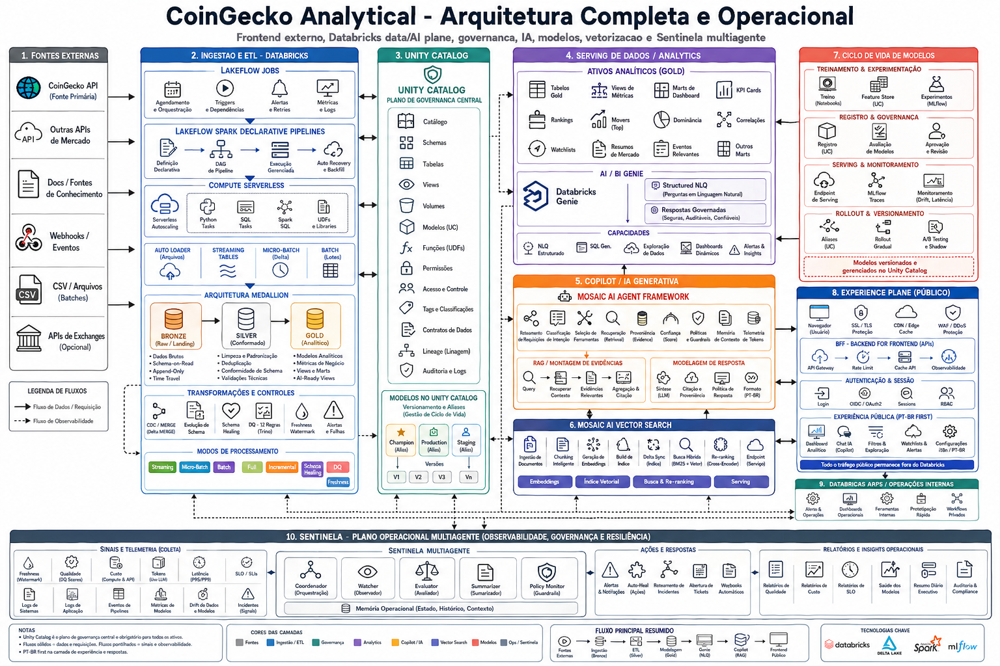

# CoinGeckoAnalytical

Plataforma de crypto market intelligence com frontend externo, Databricks como plano de dados e IA, e um sentinela multiagente para orquestração e observabilidade.

## Arquitetura

## Estrutura Atual

- `frontend externo` para a experiência pública
- `Databricks` para ingestão, ETL, governança, serving analítico e IA
- `Genie` para perguntas estruturadas sobre dados Gold
- `Mosaic AI Agent Framework` para o copilot de mercado
- `Sentinela` para coordenação multiagente e observabilidade
- `Databricks Apps` apenas para admin e operação interna
- `frontend/` com shell real para dashboard e chat, preparado para BFF

## Documentação

- [Arquitetura completa](docs/architecture.md)

## Artefatos do Projeto

- brainstorm: `.agentcodex/features/BRAINSTORM_coingeckoanalytical.md`
- define: `.agentcodex/features/DEFINE_coingeckoanalytical.md`
- design: `.agentcodex/features/DESIGN_coingeckoanalytical.md`
- build: `.agentcodex/features/BUILD_coingeckoanalytical.md`

## Workflows

- `terraform.yml`: infra and governance plan/apply
- `ci.yml`: validation and manual Databricks deploy approval
- `bronze-migration.yml`: manual Bronze schema remediation approval

## Approval Model

- [Approval policy](.agentcodex/ops/approval-gate-policy.md)
- [Current approval status](.agentcodex/reports/approval-gate-status.md)

## Direcao Atual

- fonte principal inicial: `CoinGecko API`
- arquitetura alvo: `external frontend + Databricks data/AI plane + sentinela ops plane`
- observabilidade: tokens, custo, freshness, qualidade e trilha de auditoria
- fase ativa: `build reset`
- postura atual: `o repo tem scaffolding tecnico forte, mas ainda nao fechou um slice real de produto`
- proximo passo: `implementar um V1 real ponta a ponta antes de retomar deploy ou ship`
